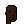
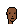
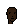
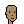
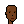
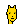
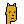

Note: See [**/punkart.spritesheet**](https://github.com/openpunkart/punkart.spritesheet) -
The Unicode-Like Universal Code Page for All Punk Archetypes & Attributes - if you are looking for a free to download single all-in-one sprite sheet (image).

---

[Vol. 1 - Heads](https://github.com/openpunkart/punkart.blocks) ·
[Vol. 2 - Bodies & More](https://github.com/openpunkart/punkart.blocks.bodies) ·
[Vol. 3 - Black & White (1-Bit)](https://github.com/openpunkart/punkart.blocks.black)

# Punk Building Block Series Vol. 1 - Heads

## Basic Punk Series (24×24)

Humans (m/f) - 4 skin tones (albino/light/mid/dark)   

   

Humans (m/f) - 10 (dr. ellis) monk¹ skin tones (01/02/03/04/05/06/07/08/09/10)   

   

¹: See [Skin Tone Research @ Google A.I.](https://skintone.google/) for background reading.

Humans (m/f) - 20 more skin tones    

   

Humans (m/f) - more skin tones (cont.)   

   

More -
Zombies (m/f)
 ,
Apes (m/f),
 ,
Aliens (m/f)
 .

Bonus: Marcs  -
Human (m) ,
Zombie (m) ,
Apes (m)   ,
Aliens (m)   ,
Demons (m)  ,
Orc (m)   ,
Skeleton (m) .

<!-- note:
  sort attributes a-z for now - why? why not?
-->

Attributes (by category and a-z):
- Hat -
  Bandana (m/f)
   ,
  Beanie (m/f)
   ,
  Cap (m/f)
   ,
  Cap Forward (m/f)
   ,
  Cowboy Hat (m/f)
   ,
  Do-rag (m/f)
    ,
  Fedora (m/f)
   ,
  Headband (m/f)
   ,
  Knitted Cap (m/f)
   ,
  Pilot Helmet (m/f)
    ,
  Police Cap (m/f)
   ,
  Tassle Hat (m/f)
    ,
  Tiara (m/f)
    ,
  Top Hat (m/f)
   
- (Hair+Hat) Combo -
  Black With Headband (m/f)
   ,
  Pink With Hat (m/f)
   
- Eyes -
  3D Glasses (m/f)
    ,
  Big Shades (m/f)
   ,
  Classic Shades (m/f)
   ,
  Eye Mask (m/f)
   ,
  Eye Patch (m/f)
   ,
  Horned Rim Glasses (m/f)
   ,
  Nerd Glasses (m/f)
   ,
  Regular Shades (m/f)
  
  
  ,
  Small Shades (m/f)
   ,
  VR (m/f)
   ,
  Welding Goggles (m/f)
   
- Eyes (Makeup) -
  Blue Eye Shadow (f)
  ,
  Clown Eyes Blue (m/f)
   ,
  Clown Eyes Green (m/f)
   ,
  Green Eye Shadow (f)
  ,
  Purple Eye Shadow (f)
  
- Blemishes -
  Mole (m/f)
    ,
  Rosy Cheeks (m/f)
    ,
  Spots (m/f)
    
- Nose -
  Clown Nose (m/f)
    ,
  Piercing (m/f)
    
- Ears -
  Earring (m/f)
    
- Mouth (Teeth) -
  Buck Teeth (m)
   
- Mouth (Emotion) -
  Frown (m)
   ,
  Smile (m)
   
- Mouth (Makeup) -
  Black Lipstick (f)
   ,
  Hot Lipstick (f)
   ,
  Purple Lipstick (f)
   
- Mouth Prop -
  Cigarette (m/f)
    ,
  Gas Mask (m/f)
    ,
  Medical Mask (m/f)
    ,
  Pipe (m/f)
    ,
  Vape (m/f)
    
- Neck Accessory -
  Choker (m/f)
     ,
  Gold Chain (m/f)
    ,
  Silver Chain (m/f)
    
- Clothes -
  Hoodie (m/f)
   

## Unisize Punk(ette) Series (24×24)

_"Upsized" female archetypes to the same size / dimensions (with same eyes/nose/mouth/ear positions) as male archetypes_

Humans (f)

,
Zombies (f),
,
Apes (f),
,
Aliens (f)
.

Attributes¹ (by category and a-z):
- Hair -
  Blonde Bob (f)
  ,
  Crazy Hair (f)
  ,
  Wild Hair (f)
  
- Eyes (Makeup) -
  Green Eye Shadow (f)
  

¹: "Upsized" (female only) from the basic series

## Faceless Punk Series (24×24)

_Unisize & unisex archetypes from scratch / zero. Add your own eyebrows / eyes / nose / mouth_

Humans (u)

.

Attributes (by category and a-z):

- Eyebrows -
  Eyebrows (u)
  
- Eyes -
  Eyes (u)
  
- Nose -
  Nose (u)
  ,
  Nose Small (u)
  
- Mouth -
  Mouth (u)
  ,
  Mouth Darker/Dark/Light (f)
  
  
  
- Mouth (Emotion) -
  Smile Darker/Dark/Light (f)
  
  
  

## All Natural Punk Series (24×24)

_More skin is the new black_

Human (male/female) 
             
             
             
             
             
             
             ,
Alien (male) 
              .png),
Ape (male)   ,
Zombie (male)  
               .png),
Skeleton (male)  ,
Demon (male)     

## More Series (24×24)

_New hat, eyes, ears & more_

<!-- note:
  sort attributes a-z for now - why? why not?
-->

Attributes (by category and a-z):
- Hat -
  Birthday Hat (m/f)  ,
  Bow (f)  ,
  Crown (m/f)  ,
  Flowers (f)  ,
  Headbands (m)    
   
   
   
   
   
   
   
   
   ,
  Jester Hat (m/f)  ,
  Santa Hat (m/f)  ,
  Sombrero¹ (m/f)  ,
  Sun Hat (m/f)  ,
  Superhero Tiara (f) 
  Viking Helmet (m/f)  ,
  Winter Hat (m/f)  ,
  Wizard Hat (m) 
- Eyes -
  Heart Shades (m/f)   ,
  Laser Eyes (m/f)       ,
  Laser Eyes Gold (m/f)  ,
  Laser Eyes Blue (m)  ,
  Ski Googles (m/f)    ,
  Tears (m/f)          
- Eyes (Makeup) -
  Clown Eyes Purple (m/f)   
- Nose -
  Clown Nose Blue (m/f)  ,
  Clown Nose Green (m/f)  
- Ears -
  Silver Earring (m/f)  
- (Covid) Masks -
  White (m/f)   ,
  Yellow (m/f)   ,
  Pink (m/f)    ,
  Rainbow (m/f)   ,
  Blue (m/f)   ,
  Black (m/f)   ,
  Cloth White (m/f)   ,
  Cloth Green (m/f)    ,
  Cloth Orange (m/f)   ,
  Cloth Red (m/f)     ,
  Cloth Brown (m/f)   ,
  Cloth Purple (m/f)  ,
  Cloth Blue (m/f)    ,
  KN-95 (m/f)   ,
  KN-95 Yellow (m/f)  ,
  KN-95 Black (m/f)   
- Mouth (Makeup) -
  Pink Lipstick (f) ,
  Red Lipstick (f) 
- Mouth Prop -
  Bubble Gum (m/f)  ,
  Cigar (m/f)  
- Neck Accessory -
  Gold Diamond Necklace (m/f)   
- Clothes -
  Bear Hood (m/f)  ,
  Frog Hood (m/f)  

¹: Alternative to the int'l headwear series

## Int'l Headwear Series (24×24)

_New international headwear from around the world_

Australian Cork Hat (m/f)  ,
Ayam (m/f)   ,
Bamboo Hat (m/f)   ,
Baseball Cap (m/f)  ,
Bear Skin (m/f)   ,
Beer Bong (m/f)  ,
Beret (m/f)   ,
Boater (m/f)   ,
Bororo (m/f)   ,
Chichak Helmet (m/f)   ,
Chinese Landlords Hat (m/f)   ,
Chullo (m/f)   ,
Fedora¹ (m/f)   ,
Fez (m/f)   ,
Fisherman Cap (m/f)   ,
Flamenco Hat (m/f)   ,
Flower Crown (m/f)    ,
Gat (m/f)   ,
Gaucho (m/f)   ,
Hennin (m/f)   ,
Isicholo (m/f)   ,
Jaapi (m/f)   ,
Keffiyeh (m/f)   ,
Krakowiak (m/f)   ,
Misango Cap (m/f)   ,
Newsboy Cap (m)  ,
Panama Hat (m/f)   ,
Rasta (m/f)   ,
Royal Cocktail Hat (f)  ,
Sibenik (m/f)   ,
Sombrero (m/f)   ,
Tam-O-Shanter (m/f)   ,
Trapper Hat (m/f)   ,
Tuque (m/f)   ,
Turban (m/f)   ,
Tyrolean (m/f)   ,
Ushanka (m/f)   ,
Viking Hat (m/f)   

Saudis - Shemagh (& Agal)  (m)  
  
  
  
  
  
  
  
  
  ,
 Niquab (f)  
  

Jews  - Hats (m)  
  
  
  
  

¹: Alternatives to the basic series

## Planet of the Apes Series (24×24)

_The rise of more new punk apes_

Ape (male,/female)  ¹ -

,
Ape Zombie (male) ,
Ape Alien (male) 

¹: From the basic series

## More Species Series (24×24)

_New species_

Demon (male / female)   ,
Vampire (male / female)   ,
Orc (male / female)   ,
Ghost (male / female)   ,
Skeleton (male / female)   ,
Mummy (male / female)   ,
Robot (male / female)    ,
Joker (male / female)    ,
Jack-O-Lantern (male / female)   ,
Scream (male / female)    ,
Frankenstein (male / female)    

Cyborgs  (male / female)

,
Metal (male / female )

,
Ape (male)
,
Metal (male)

## Gold(en) Series (24×24)

_Super-rare gold(en) punks in three variants (shiny, metallic, dark)_

  /

  /

  /

## Alien Invasion Series (24×24)

_Aliens in more colors (by degree on the HSL color wheel)_

Aliens (Male/Female) in red (0°), orange (30°),  yellow (60°),
yellow green (90°), green (120°),
cyan green (°150), cyan (°180),
cyan blue (°210),
blue (°240),
violet (°270),
magenta (°300) and red magenta (°330).

Alien Apes (Male)

## All Caps Series (24×24)

_(Baseball) caps in more colors (by degree on the HSL color wheel)_

Caps in red (0°), orange (30°), yellow (60°),
yellow green (90°), green (120°),
cyan green (°150), cyan (°180),
cyan blue (°210),
blue (240°),
violet (°270),
magenta (°300) and red magenta (°330).

## Fast Food Series (24×24)

_(Baseball) caps & more in fast food chain styles & colors_

- Caps -
  Baskin-Robbins (m/f)  
                        ,
  Burger King (m/f)  
                     ,
  White Castle (m/f)  
                      ,
  Domino's Pizza (m/f)  
                        ,
  Dunkin' Donuts (m/f)  
                        ,
  Pizza Hut (m/f)  
                   ,
  Jack in the Box (m/f)  
                         ,
  Kentucky Fried Chicken (m/f)  
                                ,
  McDonald's (m/f) 
                   
          
          
          
          
          
          
          
                   
          
          
          
          
          
          ,
  Subway (m/f)  
                ,
  Wendy's (m/f)  
                 
- Cowboy Hats -
  McDonald's (m) 
- Safari Hats -
  Kentucky Fried Chicken (m) 
- Bucket Hats -
  McDonald's (m) 
- Crowns -
  Burger King (m) 

## World of Women Series (24×24)

_New skin tones, new eye colors, new lipsticks_

Skin Tones (Classic Series) -
Light Warm Olive ,
Medium Olive ,
Medium Gold ,
Deep Warm Gold ,
Deep Bronze ,
Deep Neutral ,
Golden ,
Burning Red ,
Cyper Green ,
Cool Blue ,
Night Goddess 

Skin Tones II (Big Eyes Series) -

Skin Tones III (Natural Series) -

Eyes -
Blue ,
Purple ,
Brown ,
Green 

Lipsticks -
Party Pink ,
Passion Red ,
Burgundy ,

## Normie Series (24×24)

_Left-facing? Right-facing? Normie designs use the golden middle. Male? Female? Non-binary? Normie designs are unisex_

Human    ,
Alien ,
Ape ,
Zombie  ,
Demon  ,
Skeleton  

## Doge Series (24×24)

_Shiba Inu dogs - Much wow_

Classic ,
Dark ,
Alien ,
Zombie 

<!-- note:
  sort attributes a-z for now - why? why not?
-->

Attributes (by category and a-z):

- Hat  -
  Bandana ,
  Beanie ,
  Cap  ,
  Cap Forward ,
  Cowboy Hat ,
  Fedora ,
  Headband ,
  Knitted Cap ,
  Tiara ,
  Top Hat 
- Hair -
  Crazy Hair 
- Eyes -
  3D Glasses ,
  Big Shades  ,
  Classic Shades ,
  Eye Patch   ,
  Nerd Glasses  ,
  Regular Shades  ,
  Small Shades  

## Questions? Comments?

Join us in the [Punk Art discord (chat server)](https://discord.gg/FE3HeXNKRa). Yes you can.
Your questions and commentary welcome.

Or post them over at the [Help & Support](https://github.com/geraldb/help) page. Thanks.

