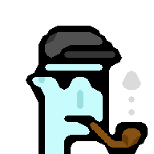

# Punk Building Block Series


## Original CryptoPunks Series (24×24)

Humans (Male/Female)


,
Aliens (Male)
,
Apes (Male),
,
Zombies (Male)
.


Attributes - Crazy Hair ,
Beanie ,
Cap ,
Cap Forward ,
Knitted Cap ,
Fedora ,
Cowboy Hat ,
Top Hat ,
Bandana ,
Headband ,
Nerd Glasses ,
3D Glasses ,
Small Shades ,
Regular Shades ,
Classic Shades ,
Big Shades ,
Eye Patch ,
Pipe ,
Smile 


<!-- note:
       double check/todo: some attribute need a variant for females (width less by one or such)
       e.g. shades and others!!!!
-->


## World of Women Series (24x24)

_New skin tones, new eye colors, new lipsticks_

Skin Tones (Classic Series) -
Light Warm Olive ,
Medium Olive ,
Medium Gold ,
Deep Warm Gold ,
Deep Bronze ,
Deep Neutral ,
Golden ,
Burning Red ,
Cyper Green ,
Cool Blue ,
Night Goddess 


Skin Tones II (Big Eyes Series) -


Skin Tones III (Natural Series) -


Eyes -
Blue ,
Purple ,
Brown ,
Green 

Lipsticks -
Party Pink ,
Passion Red ,
Burgundy ,


## Alien Invasion Series (24x24)

_Aliens in more colors (by degree on the HSL color wheel)_

Aliens (Male) in red (0°), orange (30°),  yellow (60°),
, chartreuse (90°), green (120°), magenta (°300), fuchsia (°330), and more.


## All Caps Series (24x24)

_(Baseball) caps in more colors (by degree on the HSL color wheel)_

Caps in red (0°), orange (30°),
chartreuse (90°),
green (120°),
blue (240°),
magenta (300°),
fuchsia (330°), and more.


## More Series (24x24)

_New species, new attributes_

Alien (female) ,
Ape (female) ,
Zombie (female) ,
Demon (male / female)  ,
Vampire (male / female)  ,
Orc (male / female)  ,
Skeleton (male / female)  ,
Mummy (male / female)  ,
Robot (male / female)  


## Planet of the Apes Series (24x24)

_The rise of more new punk apes_

Ape (male¹,/female²)  ,
Ape Zombie (male) ,
Ape Alien (male) 

¹: From the original series<br>
²: From the more series


## All Natural Series (24x24)

_More skin is the new black_

Human (male) 
             
             
             ,
Alien (male) ,
Ape (male)   
             
             ,
Zombie (male)  ,
Skeleton (male)  ,
Demon (male)     


## Normie Series (24x24)

_Left-facing? Right-facing? Normie designs use the golden middle. Male? Female? Non-binary? Normie designs are unisex_

Human    ,
Alien ,
Ape ,
Zombie  ,
Demon  ,
Skeleton  


## Wall Street Bets Series (24x24)

_Power to the punks_

Hair   ,
Crazy Hair   ,
Regular Shades¹  
Big Shades   

¹: From the original series


## Laser Eyes Series (24x24)

_Punks with super powers_

Laser Eyes  


## Dodge Series (32x32)

_Shiba Inu dogs - Much wow_

Classic ,
Dark ,
Alien ,
Zombie 


Attributes -
Crazy Hair ,
Beanie ,
Cap  ,
Cap Forward ,
Knitted Cap ,
Fedora ,
Cowboy Hat ,
Top Hat ,
Bandana ,
Headband ,
Regular Shades  ,
Classic Shades ,
Small Shades  ,
Big Shades  ,
Eye Patch   ,
Nerd Glasses  ,
3D Glasses ,
Tiara 


##  DIY (Do-It-Yourself) - Yes, You Can! Design Your Own Punks Using the Punk (Building) Blocks

Use the [free ImageMagick tools](https://imagemagick.org)
to make your own punks.


### Alien with Cap Forward, Small Shades & Pipe

Let's make punk #7804 - a super rare alien

with a capforward
,
smallshades

and a pipe

from scratch:

```
$ magick convert alien-male.png \
                 capforward.png \
                 smallshades.png \
                 pipe.png \
         -background none -flatten punk7804.png
```

<!--
$ magick convert alien-male.png capforward.png smallshades.png pipe.png -background none -flatten punk7804.png
-->

Now open up the new `punk7804.png`. Enjoy your million-dollar punk look-a-alike. Yes, it's
a 100% true authentic pixel ~~copy~~ original.


Zooming In - 2x, 4x


Scale up the image by doubling the pixels (that is, use the `-filter point` option).
Let's try 2x (that is, 200%):

```
$ magick convert punk7804.png \
         -filter point -resize 200% punk7804x2.png
```

<!--
$ magick convert punk7804.png -filter point -resize 200% punk7804x2.png
 -->


And 4x (that is, 400%):

```
$ magick convert punk7804.png \
         -filter point -resize 400% punk7804x4.png
```


<!--
$ magick convert punk7804.png -filter point -resize 400% punk7804x4.png
 -->


Why stop? Let's add a smile !

```
$ magick convert punk7804.png \
                 smile-alien.png \
         -background none -flatten punk7804_smile.png
```

<!--
$ magick convert punk7804.png smile-alien.png  -background none -flatten punk7804_smile.png
-->

   2x, 4x:


Try the natural version :

   2x, 4x:


#### Alien Invasion

Let's try the green (120°) variant.
Let's make - a super rare alien

with a capforward
,
smallshades

and a pipe

from scratch:

```
$ magick convert alien-male_120.png \
                 capforward.png \
                 smallshades.png \
                 pipe.png \
         -background none -flatten punk7804_120.png
```

<!--
$ magick convert alien-male_120.png capforward.png smallshades.png pipe.png -background none -flatten punk7804_120.png

$ magick convert punk7804_120.png -filter point -resize 200% punk7804_120x2.png

$ magick convert punk7804_120.png -filter point -resize 400% punk7804_120x4.png
-->

   2x, 4x:


Or try the 90°  variant - `alien-male_90.png`:

   2x, 4x:


Or 150°  - `alien-male_150.png`:

   2x, 4x:


### Alien with Cap

Let's make punk #2890 - another super rare alien

with a cap

from scratch:

```
$ magick convert alien-male.png \
                 cap.png \
         -background none -flatten punk2890.png
```

<!--
$ magick convert alien-male.png cap.png -background none -flatten punk2890.png
-->


   2x, 4x:


Try the natural version :

   2x, 4x:


#### All Caps

Let's try the red (0°) variant.
Let's make - a super rare alien

with a cap

from scratch:

```
$ magick convert alien-male.png \
                 cap_0.png \
         -background none -flatten punk2890_0.png
```

<!--
$ magick convert alien-male.png cap_0.png -background none -flatten punk2890_0.png

$ magick convert punk2890_0.png -filter point -resize 200% punk2890_0x2.png

$ magick convert punk2890_0.png -filter point -resize 400% punk2890_0x4.png
-->

   2x, 4x:


Or try the blue (240°)  variant - `cap_240.png`:

   2x, 4x:


### Humans with Cap

Or let's make a (light skintone) human punk

with a red (0°) cap

and a smile

from scratch:


```
$ magick convert human-male_light.png \
                 cap_0.png \
                 smile.png \
         -background none -flatten human_light.png
```

<!--
$ magick convert human-male_light.png cap_0.png smile.png -background none -flatten human_light.png

$ magick convert human_light.png -filter point -resize 200% human_lightx2.png
-->

   2x, 4x:


Or try the dark skintone  variant - `human-male_dark.png` -
with a green (120°) cap   - `cap_120.png`:


<!--
$ magick convert human-male_dark.png cap_120.png smile.png -background none -flatten human_dark.png
-->


   2x, 4x:


### Dodge Shiba Inu - Much Wow

Let's make a dodge punk  - a super rare alien

with a headband

from scratch:

```
$ magick convert alien.png \
                 headband.png \
         -background none -flatten dodge3100.png
```

<!--
 $ magick convert alien.png headband.png -background none -flatten dodge3100.png

 $ magick convert dodge3100.png -filter point -resize 200% dodge3100x2.png
  -->

 2x, 4x:


Or let's make a zombie

with a knitted cap

from scratch:


```
$ magick convert zombie_notop.png \
                 knittedcap.png \
         -background none -flatten dodge2066.png
```

<!--
 $ magick convert zombie_notop.png knittedcap.png -background none -flatten dodge2066.png

 $ magick convert dodge2066.png -filter point -resize 200% dodge2066x2.png
  -->

 2x, 4x:


Or let's make a classic

with a 3d glasses

from scratch:


```
$ magick convert classic.png \
                 3dglasses.png \
         -background none -flatten dodge_3dglasses.png
```

<!--
 $ magick convert classic.png 3dglasses.png -background none -flatten dodge_3dglasses.png

 $ magick convert dodge_3dglasses.png -filter point -resize 200% dodge_3dglassesx2.png
  -->


 2x, 4x:


And so on. Yes, you can.


## Bonus - ImageMagick Special Effects

Use the [free ImageMagick tools](https://imagemagick.org)
to script special effects (on the command line).


### Polaroid-Like Photos

Let's start with a "plain vanilla" punk, that is, #2890  and
let's use the 4x (96x96) version
and turn it into a captioned polaroid-like photo:

```
$ magick convert punk2890x4.png \
          -gravity center -set caption "Punk #2890" \
          -caption '%c' \
          -border 5x5 \
          -bordercolor AliceBlue -background black  +polaroid \
          polaroid2890.png
```


And let's try some more:


### Magnify 2x, 3x 4x with (Smooth) Pixel Art Scaling Algorithm

Let's start with a "plain vanilla" punk, that is, #2890  and
let's use 2x magnified (48x48) version
using a (smooth) [pixel art scaling algorithm¹](https://en.wikipedia.org/wiki/Pixel-art_scaling_algorithms)):

Note¹: ImageMagic uses the [scale2x](http://www.scale2x.it/algorithm) algorithm

<!--
  more on github @ https://github.com/amadvance/scale2x/
  -->


```
$ magick convert punk2890.png \
          -magnify \
          punk2890_magnify2x.png
```


And doubling again (4x):

```
$ magick convert punk2890.png \
          -magnify -magnify \
          punk2890_magnify4x.png
```


And doubling again (8x):

```
$ magick convert punk2890.png \
          -magnify -magnify -magnify \
          punk2890_magnify8x.png
```


And let's try some more:





Power Tip - Let's retry with the [high quality scale (hqx)
pixel art scaling algorithm family](https://en.wikipedia.org/wiki/Hqx) in the 2x, 3x and 4x variants.

Note:  A free ImageMagick tools installation gets you
a copy of ffmpeg. Let's try:

```
$ ffmpeg -i punk2890.png \
          -filter_complex hqx=2 \
          punk2890_hqx2.png
```


And 3x:

```
$ ffmpeg -i punk2890.png \
          -filter_complex hqx=3 \
          punk2890_hqx3.png
```


And 4x:

```
$ ffmpeg -i punk2890.png \
          -filter_complex hqx=4 \
          punk2890_hqx4.png
```


And let's try some more:


And so on. Yes, you can.


## Questions? Comments?

Post them on the [CryptoPunksDev reddit](https://old.reddit.com/r/CryptoPunksDev). Thanks.
