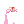
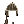
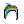
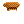
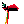
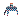
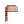

# Punk Building Block Series


## Basic Punk Series (24×24)

_Formerly known as ~Original CryptoPunks~_

Humans (m/f)


,
Zombies (m/f)
 ,
Apes (m/f),
 ,
Aliens (m/f)
 .


<!-- note:
  sort attributes a-z for now - why? why not?
-->

Attributes (by category and a-z):
- Hat -
  Bandana (m/f)
   ,
  Beanie (m/f)
   ,
  Cap (m/f)
   ,
  Cap Forward (m/f)
   ,
  Cowboy Hat (m/f)
   ,
  Do-rag (m/f)
   ,
  Fedora (m/f)
   ,
  Headband (m/f)
   ,
  Hoodie (m/f)
   ,
  Knitted Cap (m/f)
   ,
  Pilot Helmet (f)
  ,
  Police Cap (m/f)
   ,
  Tassle Hat (f)
  ,
  Tiara (f)
  ,
  Top Hat (m/f)
   
- Hair -
  Blonde Bob (f)
  ,
  Blonde Short (f)
  ,
  Clown Hair Green (m/f)
   ,
  Crazy Hair (m/f)
   ,
  Dark Hair (f)
  ,
  Frumpy Hair (m/f)
   ,
  Half Shaved (f)
  ,
  Messy Hair (m/f)
   ,
  Mohawk (m/f)
   ,
  Mohawk Dark (m/f)
   ,
  Mohawk Thin (m/f)
   ,
  Orange Side (f)
  ,
  Peak Spike (m)
  ,
  Pigtails (f)
  ,
  Pink With Hat (f)
  ,
  Purple Hair (m/f)
   ,
  Red Mohawk (f)
  ,
  Shaved Head (m/f)
   ,
  Straight Hair (f)
  ,
  Straight Hair Blonde (f)
  ,
  Straight Hair Dark (f)
  ,
  Stringy Hair (m/f)
   ,
  Vampire Hair (m)
  ,
  Wild Blonde (f)
  ,
  Wild Hair (m/f)
   ,
  Wild White Hair (f)
  
- Eyes -
  3D Glasses (m/f)
    ,
  Big Shades (m/f)
   ,
  Classic Shades (m/f)
   ,
  Eye Mask (m/f)
   ,
  Eye Patch (m/f)
   ,
  Horned Rim Glasses (m/f)
   ,
  Nerd Glasses (m/f)
   ,
  Regular Shades (m/f)
   ,
  Small Shades (m/f)
   ,
  VR (m/f)
   ,
  Welding Goggles (f)
  
- Eyes (Makeup) -
  Blue Eye Shadow (f)
  ,
  Clown Eyes Blue (m/f)
   ,
  Clown Eyes Green (m/f)
   ,
  Green Eye Shadow (f)
  ,
  Purple Eye Shadow (f)
  
- Blemishes -
  Mole (m/f)
    ,
  Rosy Cheeks (m/f)
    ,
  Spots (m/f)
    
- Nose -
  Clown Nose (m/f)
    
- Ears -
  Earring (m/f)
    
- Mouth -
  Buck Teeth (m)
   ,
  Frown (m)
   ,
  Smile (m)
   
- Mouth (Makeup) -
  Black Lipstick (f)
   ,
  Hot Lipstick (f)
   ,
  Purple Lipstick (f)
   
- Mouth Prop -
  Cigarette (m/f)
    ,
  Medical Mask (m/f)
    ,
  Pipe (m/f)
    ,
  Vape (m/f)
    
- Beard -
  Big Beard (m)
   ,
  Chinstrap (m)
   ,
  Front Beard (m)
   ,
  Front Beard Dark (m)
   ,
  Goat (m)
   ,
  Handlebars (m)
   ,
  Luxurious Beard (m)
   ,
  Mustache (m)
   ,
  Muttonchops (m)
   ,
  Normal Beard (m)
   ,
  Normal Beard Black (m)
   ,
  Shadow Beard (m)
   
- Neck Accessory -
  Choker (f)
   ,
  Gold Chain (m/f)
    ,
  Silver Chain (m/f)
    


## Int'l Headwear Series (24×24)

_New international headwear from around the world_

Australian Cork Hat (m/f)  ,
Ayam (m/f)   ,
Bamboo Hat (m/f)   ,
Baseball Cap (m/f)  ,
Bear Skin (m/f)   ,
Beer Bong (m/f)  ,
Beret (m/f)   ,
Boater (m/f)   ,
Bororo (m/f)   ,
Chichak Helmet (m/f)   ,
Chinese Landlords Hat (m/f)   ,
Chullo (m/f)   ,
Fedora¹ (m/f)   ,
Fez (m/f)   ,
Fisherman Cap (m/f)   ,
Flamenco Hat (m/f)   ,
Flower Crown (m/f)    ,
Gat (m/f)   ,
Gaucho (m/f)   ,
Hennin (m/f)   ,
Isicholo (m/f)   ,
Jaapi (m/f)   ,
Keffiyeh (m/f)   ,
Krakowiak (m/f)   ,
Misango Cap (m/f)   ,
Newsboy Cap (m)  ,
Panama Hat (m/f)   ,
Rasta (m/f)   ,
Royal Cocktail Hat (f)  ,
Sibenik (m/f)   ,
Sombrero 1 (m/f)   ,
Sombrero 2 (m/f)  ,
Tam-O-Shanter (m/f)   ,
Top Hat¹ (m/f)   ,
Trapper Hat (m/f)   ,
Tuque (m/f)   ,
Turban (m/f)   ,
Tyrolean (m/f)   ,
Ushanka (m/f)   ,
Viking Hat (m/f)   ,
Viking Helmet (m/f)  

¹: Alternatives to the basic series


## More Series (24×24)

_New hat, eyes, ears & more_

<!-- note:
  sort attributes a-z for now - why? why not?
-->


Attributes (by category and a-z):
- Hat -
  Bear Hood (m/f)  ,
  Birthday Hat (m/f)  ,
  Bow (f)  ,
  Crown (m/f)  ,
  Flowers (f)  ,
  Frog Hood (m/f)  ,
  Jester Hat (m/f)  ,
  Santa Hat (m/f)  ,
  Sun Hat (m/f)  ,
  Superhero Tiara (f) 
  Winter Hat (m/f)  
- Eyes -
  Heart Shades (m/f)   ,
  Laser Eyes (m)      ,
  Laser Eyes Gold (m) ,
  Ski Googles (m/f)    ,
  Tears (m/f)          
- Ears -
  Silver Earring (m/f)  
- Mouth (Makeup) -
  Pink Lipstick (f) ,
  Red Lipstick (f) 
- Mouth Prop -
  Cigar (m/f)  
- Neck Accessory -
  Gold Diamond Necklace (m/f)   


## More Hair Style & Color Series (24×24)

_Is orange the new black?_


Bob (f) 

Short (f) 


## Alien Invasion Series (24×24)

_Aliens in more colors (by degree on the HSL color wheel)_

Aliens (Male/Female) in red (0°), orange (30°),  yellow (60°),
yellow green (90°), green (120°),
cyan green (°150), cyan (°180),
cyan blue (°210),
blue (°240),
violet (°270),
magenta (°300) and red magenta (°330).


Alien Apes (Male)


## All Caps Series (24×24)

_(Baseball) caps in more colors (by degree on the HSL color wheel)_

Caps in red (0°), orange (30°),
yellow green (90°),
green (120°),
blue (240°),
magenta (300°),
red magenta (330°).


## Planet of the Apes Series (24×24)

_The rise of more new punk apes_

Ape (male¹,/female¹)  ,
Ape Zombie (male) ,
Ape Alien (male) 

¹: From the basic series


## More Species Series (24×24)

_New species_


Demon (male / female)  ,
Vampire (male / female)  ,
Orc (male / female)  ,
Skeleton (male / female)  ,
Mummy (male / female)  ,
Robot (male / female)  


## World of Women Series (24×24)

_New skin tones, new eye colors, new lipsticks_

Skin Tones (Classic Series) -
Light Warm Olive ,
Medium Olive ,
Medium Gold ,
Deep Warm Gold ,
Deep Bronze ,
Deep Neutral ,
Golden ,
Burning Red ,
Cyper Green ,
Cool Blue ,
Night Goddess 


Skin Tones II (Big Eyes Series) -


Skin Tones III (Natural Series) -


Eyes -
Blue ,
Purple ,
Brown ,
Green 

Lipsticks -
Party Pink ,
Passion Red ,
Burgundy ,


## All Natural Series (24×24)

_More skin is the new black_

Human (male) 
             
             
             ,
Alien (male) 
              ,
Ape (male)   ,
Zombie (male)  
               ,
Skeleton (male)  ,
Demon (male)     


## Normie Series (24×24)

_Left-facing? Right-facing? Normie designs use the golden middle. Male? Female? Non-binary? Normie designs are unisex_

Human    ,
Alien ,
Ape ,
Zombie  ,
Demon  ,
Skeleton  


## Wall Street Bets Series (24×24)

_Power to the punks_

Hair   ,
Crazy Hair   ,
Regular Shades¹  
Big Shades   

¹: From the basic series


## Dodge Series (24×24)

_Shiba Inu dogs - Much wow_

Classic ,
Dark ,
Alien ,
Zombie 


<!-- note:
  sort attributes a-z for now - why? why not?
-->

Attributes (by category and a-z):

- Hat  -
  Bandana ,
  Beanie ,
  Cap  ,
  Cap Forward ,
  Cowboy Hat ,
  Fedora ,
  Headband ,
  Knitted Cap ,
  Tiara ,
  Top Hat 
- Hair -
  Crazy Hair 
- Eyes -
  3D Glasses ,
  Big Shades  ,
  Classic Shades ,
  Eye Patch   ,
  Nerd Glasses  ,
  Regular Shades  ,
  Small Shades  


##  DIY (Do-It-Yourself) - Yes, You Can! Design Your Own Punks Using the Punk (Building) Blocks

Use the [free ImageMagick tools](https://imagemagick.org)
to make your own punks.


### Alien with Cap Forward, Small Shades & Pipe

Let's make punk #7804 - a super rare alien

with a capforward
,
smallshades

and a pipe

from scratch:

```
$ magick convert alien-male.png \
                 capforward.png \
                 smallshades.png \
                 pipe.png \
         -background none -flatten punk7804.png
```

<!--
$ magick convert alien-male.png capforward.png smallshades.png pipe.png -background none -flatten punk7804.png
-->

Now open up the new `punk7804.png`. Enjoy your million-dollar punk look-a-alike. Yes, it's
a 100% true authentic pixel ~~copy~~ original.


Zooming In - 2x, 4x


Scale up the image by doubling the pixels (that is, use the `-filter point` option).
Let's try 2x (that is, 200%):

```
$ magick convert punk7804.png \
         -filter point -resize 200% punk7804@2x.png
```

<!--
$ magick convert punk7804.png -filter point -resize 200% punk7804x2.png
 -->


And 4x (that is, 400%):

```
$ magick convert punk7804.png \
         -filter point -resize 400% punk7804@4x.png
```


<!--
$ magick convert punk7804.png -filter point -resize 400% punk7804x4.png
 -->


Why stop? Let's add a smile !

```
$ magick convert punk7804.png \
                 smile-alien.png \
         -background none -flatten punk7804_smile.png
```

<!--
$ magick convert punk7804.png smile-alien.png  -background none -flatten punk7804_smile.png
-->

   2x, 4x:


Try the natural version :

   2x, 4x:


#### Alien Invasion

Let's try the green (120°) variant.
Let's make - a super rare alien

with a capforward
,
smallshades

and a pipe

from scratch:

```
$ magick convert alien-male_120.png \
                 capforward.png \
                 smallshades.png \
                 pipe.png \
         -background none -flatten punk7804_120.png
```

<!--
$ magick convert alien-male_120.png capforward.png smallshades.png pipe.png -background none -flatten punk7804_120.png

$ magick convert punk7804_120.png -filter point -resize 200% punk7804_120x2.png

$ magick convert punk7804_120.png -filter point -resize 400% punk7804_120x4.png
-->

   2x, 4x:


Or try the 90°  variant - `alien-male_90.png`:

   2x, 4x:


Or 150°  - `alien-male_150.png`:

   2x, 4x:


### Alien with Cap

Let's make punk #2890 - another super rare alien

with a cap

from scratch:

```
$ magick convert alien-male.png \
                 cap.png \
         -background none -flatten punk2890.png
```

<!--
$ magick convert alien-male.png cap.png -background none -flatten punk2890.png
-->


   2x, 4x:


Try the natural version :

   2x, 4x:


#### All Caps

Let's try the red (0°) variant.
Let's make - a super rare alien

with a cap

from scratch:

```
$ magick convert alien-male.png \
                 cap_0.png \
         -background none -flatten punk2890_0.png
```

<!--
$ magick convert alien-male.png cap_0.png -background none -flatten punk2890_0.png

$ magick convert punk2890_0.png -filter point -resize 200% punk2890_0x2.png

$ magick convert punk2890_0.png -filter point -resize 400% punk2890_0x4.png
-->

   2x, 4x:


Or try the blue (240°)  variant - `cap_240.png`:

   2x, 4x:


### Humans with Cap

Or let's make a (light skintone) human punk

with a red (0°) cap

and a smile

from scratch:


```
$ magick convert human-male_light.png \
                 cap_0.png \
                 smile.png \
         -background none -flatten human_light.png
```

<!--
$ magick convert human-male_light.png cap_0.png smile.png -background none -flatten human_light.png

$ magick convert human_light.png -filter point -resize 200% human_lightx2.png
-->

   2x, 4x:


Or try the dark skintone  variant - `human-male_dark.png` -
with a green (120°) cap   - `cap_120.png`:


<!--
$ magick convert human-male_dark.png cap_120.png smile.png -background none -flatten human_dark.png
-->


   2x, 4x:


### Dodge Shiba Inu - Much Wow

Let's make a dodge punk  - a super rare alien

with a headband

from scratch:

```
$ magick convert alien.png \
                 headband.png \
         -background none -flatten dodge3100.png
```

<!--
 $ magick convert alien.png headband.png -background none -flatten dodge3100.png

 $ magick convert dodge3100.png -filter point -resize 200% dodge3100x2.png
  -->

 2x, 4x:


Or let's make a zombie

with a knitted cap

from scratch:


```
$ magick convert zombie_notop.png \
                 knittedcap.png \
         -background none -flatten dodge2066.png
```

<!--
 $ magick convert zombie_notop.png knittedcap.png -background none -flatten dodge2066.png

 $ magick convert dodge2066.png -filter point -resize 200% dodge2066x2.png
  -->

 2x, 4x:


Or let's make a classic

with a 3d glasses

from scratch:


```
$ magick convert classic.png \
                 3dglasses.png \
         -background none -flatten dodge_3dglasses.png
```

<!--
 $ magick convert classic.png 3dglasses.png -background none -flatten dodge_3dglasses.png

 $ magick convert dodge_3dglasses.png -filter point -resize 200% dodge_3dglassesx2.png
  -->


 2x, 4x:


And so on. Yes, you can.


## Bonus - ImageMagick Special Effects

Use the [free ImageMagick tools](https://imagemagick.org)
to script special effects (on the command line).


### Polaroid-Like Photos

Let's start with a "plain vanilla" punk, that is, #2890  and
let's use the 4x (96×96) version
and turn it into a captioned polaroid-like photo:

```
$ magick convert punk2890x4.png \
          -gravity center -set caption "Punk #2890" \
          -caption '%c' \
          -border 5x5 \
          -bordercolor AliceBlue -background black  +polaroid \
          polaroid2890.png
```


And let's try some more:


### Magnify 2x, 3x 4x with (Smooth) Pixel Art Scaling Algorithm

Let's start with a "plain vanilla" punk, that is, #2890  and
let's use 2x magnified (48×48) version
using a (smooth) [pixel art scaling algorithm¹](https://en.wikipedia.org/wiki/Pixel-art_scaling_algorithms)):

Note¹: ImageMagic uses the [scale2x](http://www.scale2x.it/algorithm) algorithm

<!--
  more on github @ https://github.com/amadvance/scale2x/
  -->


```
$ magick convert punk2890.png \
          -magnify \
          punk2890@magnify2x.png
```


And doubling again (4x):

```
$ magick convert punk2890.png \
          -magnify -magnify \
          punk2890@magnify4x.png
```


And doubling again (8x):

```
$ magick convert punk2890.png \
          -magnify -magnify -magnify \
          punk2890@magnify8x.png
```


And let's try some more:


Power Tip - Let's retry with the [high quality scale (hqx)
pixel art scaling algorithm family](https://en.wikipedia.org/wiki/Hqx) in the 2x, 3x and 4x variants.

Note:  A free ImageMagick tools installation gets you
a copy of ffmpeg. Let's try:

```
$ ffmpeg -i punk2890.png \
          -filter_complex hqx=2 \
          punk2890@hq2x.png
```


And 3x:

```
$ ffmpeg -i punk2890.png \
          -filter_complex hqx=3 \
          punk2890@hq3x.png
```


And 4x:

```
$ ffmpeg -i punk2890.png \
          -filter_complex hqx=4 \
          punk2890@hq4x.png
```


And let's try some more:


And so on. Yes, you can.


## Questions? Comments?

Post them on the [CryptoPunksDev reddit](https://old.reddit.com/r/CryptoPunksDev). Thanks.
